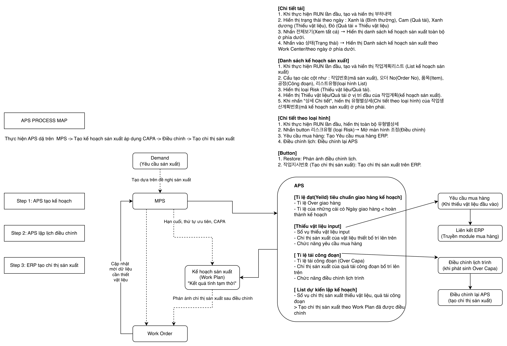
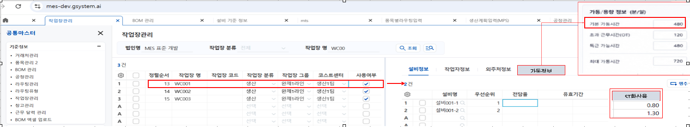
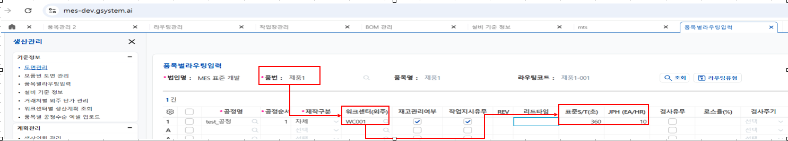
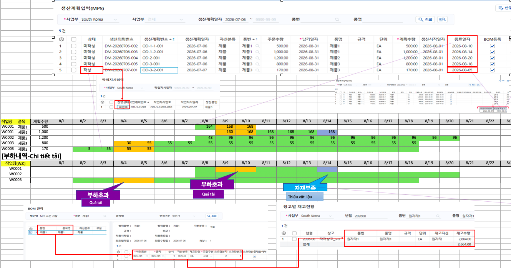

Phía GSystem sẽ cung cấp cho chúng tôi các dữ liệu để xây dựng màn hình APS, 
- Bạn quét để đọc docs/specs/Đã dịch_APS개발의뢰_20260707/APS프로세스 및 화면구성-Table 1.csv xem flow là như thế nào -> tôi cũng có vẽ ra diagram để giúp bạn làm dễ hơn: 
- Dưới đây là phần giải thích của tôi cho sheet 2 trong file docs/specs/Đã dịch_APS개발의뢰_20260707/개발의뢰-Table 1.csv:

P1. 

- Đầu tiên là phần dịch tiếng Hàn sang tiếng Việt, tôi copy lại toàn bộ: 

```
1. 가동정보Tab (tab thông tin vận hành), ST환산율(Tỉ lệ ST hoán đổi) 
(thông tin cột sheet tab 설비정보)
  1)"기본 가동시간"(thời gian vận hành mặc định) tính thời gian vận hành thiết bị tiêu chuẩn 
  2)"기본 가동시간" x "ST환산율" (thời gian vận hành mặc định x tỉ lệ ST hoán đổi)
 ex) thời gian vận hành thiết bị của máy 001-1 : 480 x 0.80 = 384p
     thời gian vận hành thiết bị của máy 001-2 : 480 x 1.30 = 624p
  -> Thời gian vận hành toàn bộ Workcenter là 1,008p (tiêu chuẩn ngày) 

※Thông tin này dự kiến sẽ phản ánh lên G-System 
  -> Tất cả workcenter đều thiết lập thời gian vận hành mặc định là 480
  -> ST환산율(Tỉ lệ ST hoán đổi) của thiết bị theo từng WC giống với bên trái
```

- Theo tôi hiểu, phía GSystem sẽ cung cấp cho team của tôi data về Work Center (WC), cụ thể là thời gian vận hành mặc định của WC, và ST cho mỗi thiết bị trong WC đó. Ví dụ trong WC001 có 2 thiết bị 설비001-1 và 설비001-2, ST  của từng thiết bị lần lượt là 0.80 và 1.30; thời gian vận hành mặc định của WC001 là 480 minutes -> thời gian vận hành của 2 thiết bị là 480x0.80=384 và 480x1.30=624 -> tổng thời gian vận hành toàn bộ của WC001 là 1008 minutes. Tương tự cho các WC khác. Ngoài các fields thiết yếu này ra còn các fields khác bổ trợ thông tin. Tôi bổ sung thêm ảnh: 

P2. 

- Đầu tiên là phần dịch tiếng Hàn sang tiếng Việt, tôi copy lại toàn bộ: 

```
2. Routing theo từng Item
 1) Thiết lập 표준S/T (Standard S/T) theo từng Work Center của từng Item 
   - Thông tin này sẽ được sử dụng khi APS tạo 작업계획(임시) (kế hoạch sản xuất (tạm thời))

 -> sản phẩm 1, số lượng sản xuất theo giờ dựa theo WC (WC001) là 10EA
     (1 ngày theo tiêu chuẩn 1,008p thì có thể sản xuất 168ea)
     ex)360 = 6p,  1,008p/6p = 168
```

- Phần trên đã giải thích rõ, tôi gửi thêm ảnh để bạn quét và đọc nếu cần: 

P3

- Phần dịch:

```
3. MPS
1) Lập kế hoạch sản xuất sản phẩm 1, sản phẩm 2, sản phẩm 3 
    - Sản phẩm 1 chờ sản xuất 500EA   
    - Sản phẩm 1 chờ sản xuất 1,000EA 
    - Sản phẩm 2 chờ sản xuất 1,200EA 
    - Sản phẩm 3 chờ sản xuất 800EA 
    - Sản phẩm 3 chờ sản xuất 170EA 
 2) Tạo 작업계획(임시) (kế hoạch sản xuất (tạm thời)) trên APS theo tiêu chuẩn 종료일자(ngày kết thúc)  
 -> Tạo kế hoạch sản xuất (kết quả tính tạm thời) bằng Backward theo tiêu chuẩn 종료일자 (ngày kết thúc)
 -> số thập phân của sản lượng theo ngày làm tròn xuống (cộng bù vào 시작일(ngày bắt đầu))
 -> Không tạo kế hoạch vào ngày trước ngày Today (Số lượng chưa tạo sẽ gộp tất cả vào ngày Today)

※ khi "상태 : 작성" (trạng thái : đã lập) thì kế hoạch sản xuất cần hiển thị theo phương pháp Backward dựa theo tiêu chuẩn "작업종료일자" (ngày kết thúc sản xuất)
   (nếu 작업종료일자 trống thì cần hiển thị theo phương pháp Backward dựa theo tiêu chuẩn"종료일자"(ngày kết thúc) 
    -> Thông tin này dự kiến sẽ phản ánh lên G-System 
```

P4.

- Phần dịch:

```
4. APS(부하내역 Chi tiết tải)
 -> Khi xử lý RUN APS, hiển thị theo Backward dựa trên CAPA
 1)Ví dụ hiển thị 부하내역(chi tiết tải) của APS 
  -Cái bên trên bên trái là tài liệu ví dụ để giải thích 
  -Cái bên dưới bên trái, cần hiển thị 부하내역(chi tiết tải sản xuất) bằng hình thức như này

※ Hiển thị 부하내역 bao gồm cả danh sách đã thực hiện 작업지시(chỉ thị sản xuất) trên G-System
  (Không bao gồm danh sách đã thực hiện 작업실적(kết quả sản xuất) vào 부하내역)
   -> Trạng thái MPS기준 (tiêu chuẩn MPS) : "작성 đã lập" , trạng thái 작업지시기준(tiêu chuẩn chỉ thị sản xuất) : "미완료 Chưa hoàn thành"
```

P5. 

```
5. Ví dụ 자재부족(thiếu vật liệu)
 1)Tiêu chuẩn sản phẩm 1 
   - Tổng sản lượng 1,500 
   - Vật liệu cần thiết : 3,000     ※ Quản lý BOM  (lượng cần thiết 2:1 ) 
   - Số lượng tồn kho : 2,664     ※창고별 재고현황 (hiện trạng tồn kho theo từng kho)
   - Số lượng thiếu  : 336       ※3,000 - 2,664 = 336

※ Cần hiển thị 자재부족(thiếu vật liệu) sau khi tính số lượng cần thiết theo ngày
  ex) (기초 + 당일입고 + 미입고 + 입고예정) - 소요예정
       (đầu kì + nhập kho trong ngày + chưa nhập kho + dự kiến nhập kho) - dự kiến cần thiết
```

- Phần thông tin ảnh P3, P4, P5: 

P6.

```
6. APS (작업계획리스트- List kế hoạch sản xuất)
 -> Khi xử lý RUN APS, hiển thị 기작업지시(미완료) (chỉ thị sản xuất đã tạo(chưa hoàn thành) & MPS기준 작업계획(임시산출) (kế hoạch sản xuất tiêu chuẩn MPS(tính tạm thời))
 1)Ví dụ hiển thị List kế hoạch sản xuất APS 
  - 작업지시번호 Mã chị thị sản xuất : mã chỉ thị sản xuất đã tạo trước đó (상태 : 미완료 trạng thái : chưa hoàn thành)
  - (임시)작업계획번호 Mã kế hoạch sản xuất (tạm thời) : tính tạm thời bằng danh sách kế hoạch sản xuất chưa lập (MPS)
  - 오더 Order : PO NO của Order
  - 품목 Item : tên Item
  - 워크센터 Work Center: Work Center (xưởng làm việc)
  - 공정 Công đoạn : Công đoạn
  - 계획수량 Số lượng kế hoạch : Số lượng 미완료 작업지시 (chỉ thị sản xuất chưa hoàn thành) / số lượng 미작성 생산계획 (kế hoạch sản xuất chưa lập)
  - 계획시작 Bắt đầu kế hoạch : 
    Nếu là 미완료 작업지시  -> Lấy 작업시작일자 (ngày bắt đầu sản xuất) trên 생산계획입력(MPS) (Nhập kế hoạch sản xuất (MPS))         			else 시작일자(Ngày bắt đầu) được tính theo phương pháp Backward của 종료일자(ngày kết thúc) trên 생산계획입력(MPS) 
    Nếu là 미작성 생산계획 -> 시작일자(Ngày bắt đầu) được tính theo phương pháp Backward của 종료일자(ngày kết thúc) trên 생산계획입력(MPS)     
 
  - 계획완료 Hoàn thành kế hoạch : 
    Nếu là 미완료 작업지시  -> Lấy 작업종료일자(ngày kết thúc sản xuất) trên 생산계획입력(MPS)
                                             else 종료일자(ngày kết thúc) trên 생산계획입력(MPS)
    Nếu là 미작성 생산계획  -> 종료일자(ngày kết thúc) trên 생산계획입력(MPS)
```

[Chi tiết theo từng loại hình]					
      1.Yêu cầu mua hàng /Điều chỉnh lịch trình / Hoàn thành xử lý				
   1)Yêu cầu mua hàng : xử lý yêu cầu mua hàng đối với cái thiếu vật liệu -> liên kết yêu cầu mua hàng  ERP				
   2)Điều chỉnh lịch trình : điều chỉnh lịch trình đối với cái quả tải -> Phản ánh trước vào 부하내역/작업계획 리스트 trong APS (Chi tiết đã xử lý sẽ phản ánh trước khi nhấn nút "Restore" góc trên bên phải) 				
      -> khi xử lý "작업지시 생성"(tạo chỉ thị sản xuất), tạo chỉ thị sản xuất trên ERP theo giá trị cuối cùng của APS		
     - Cập nhật mới dữ liệu của 생산계획입력(MPS) có trạng thái là "작성 đã lập" 				
     - Cập nhật mới dữ liệu "작업시작일자/작업종료일자(ngày bắt đầu sản xuất				
    /ngày kết thúc sản xuất)" trên 생산계획입력(MPS) 			
       ※Dự kiến phản ánh 작업시작일자/작업종료일자 lên G-System				

P7, P8 là phần giải thích giao diện HTML, bạn đọc source trong file html, tôi khỏi phải capture

P7

```
7. ASP (유형별 상세 Chi tiết theo từng loại hình)
 1)Thiếu vật liệu -> xử lý yêu cầu mua hàng -> tạo yêu cầu mua hàng ERP 
 2)Quá tải -> xử lý điều chỉnh lịch trình -> điều chỉnh lại APS  
    (Phản ánh lại APS chi tiết đã điều chỉnh khi xử lý Restore)
```

P8

```
8. APS (Button)
 1)RUN : Tính tạm thời kế hoạch sản xuất bằng Backward 생산계획(MPS) & 작업지시(미진행) 기준 Backward 작업계획 임시산출
 2)Restore : Phản ánh lại APS chi tiết đã điều chỉnh lịch trình
 3)작업지시 생성 (Tạo chỉ thị sản xuất) : tạo chỉ thị sản xuất ERP và phản ánh chỉnh sửa
 4)부하내역 상태Box (Box trạng thái chi tiết tải) : query chi tiết sản xuất theo từng WC/ theo từng ngày tương ứng
 5)전체보기 (Xem tất cả) : query toàn bộ kết quả tính tạm thời trong khoảng thời gian
```